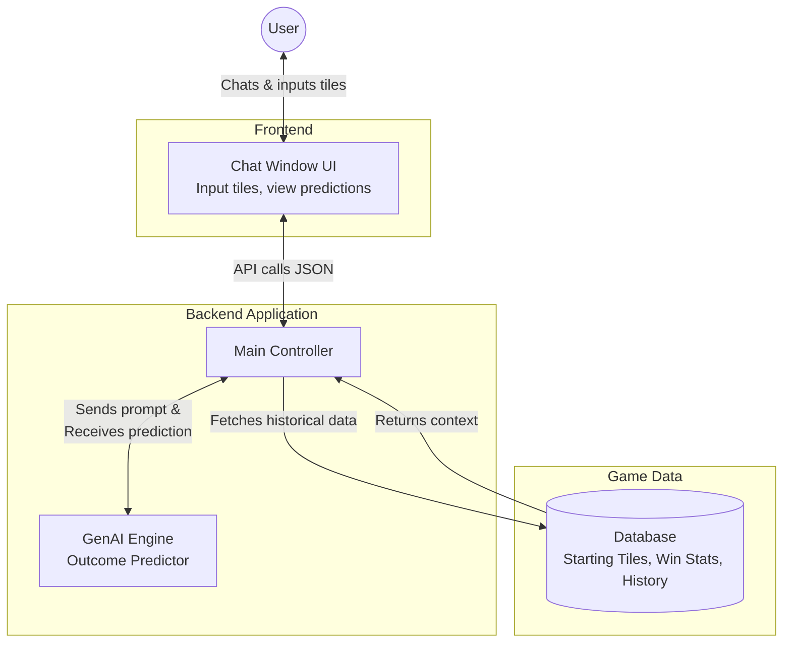
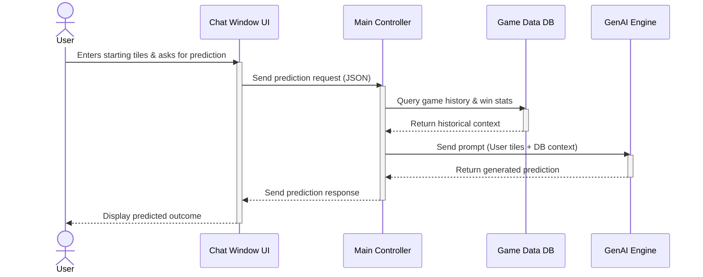
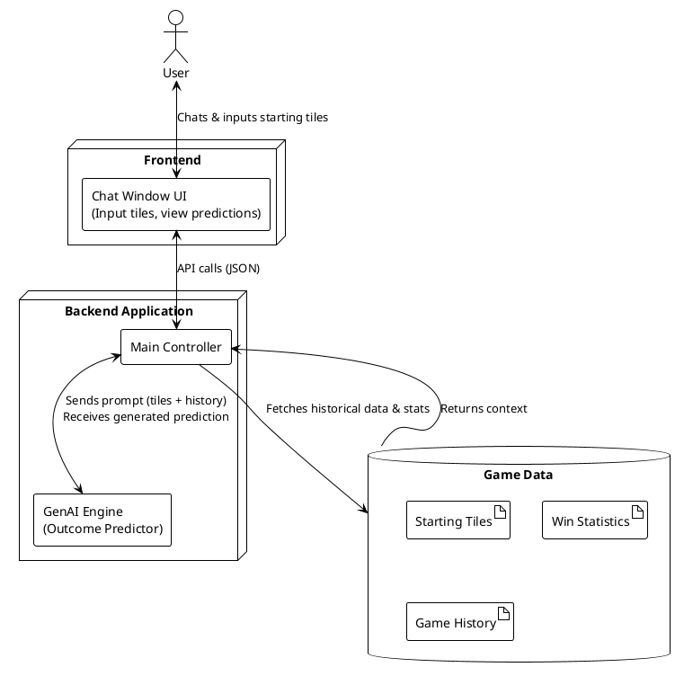
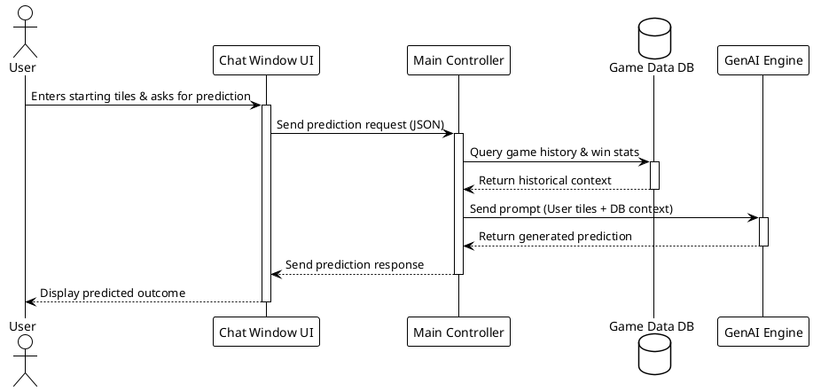

# CatanWinnerPrediction

## UMLs

Mermaid UML

```mermaid

graph TD
    User((User)) <-->|Chats & inputs tiles| UI
    
    subgraph Frontend
        UI[Chat Window UI<br/>Input tiles, view predictions]
    end
    
    UI <-->|API calls JSON| MC
    
    subgraph Backend Application
        MC[Main Controller]
        AI[GenAI Engine<br/>Outcome Predictor]
    end
    
    MC -->|Fetches historical data| DB
    DB -->|Returns context| MC
    
    MC <-->|Sends prompt &<br/>Receives prediction| AI
    
    subgraph Game Data
        DB[(Database<br/>Starting Tiles, Win Stats, History)]
    end
```

## Sequence Diagram

Mermaid Sequence Diagram

```mermaid
sequenceDiagram
    actor User
    participant UI as Chat Window UI
    participant Backend as Main Controller
    participant DB as Game Data DB
    participant AI as GenAI Engine

    User->>UI: Enters starting tiles & asks for prediction
    activate UI
    
    UI->>Backend: Send prediction request (JSON)
    activate Backend
    
    Backend->>DB: Query game history & win stats
    activate DB
    DB-->>Backend: Return historical context
    deactivate DB
    
    Backend->>AI: Send prompt (User tiles + DB context)
    activate AI
    AI-->>Backend: Return generated prediction
    deactivate AI
    
    Backend-->>UI: Send prediction response
    deactivate Backend
    
    UI-->>User: Display predicted outcome
    deactivate UI
```

## PlantUML 

```plantuml
@startuml
!theme plain
skinparam componentStyle rectangle

actor "User" as user

node "Frontend" {
    component "Chat Window UI\n(Input tiles, view predictions)" as chatUI
}

node "Backend Application" {
    component "Main Controller" as app
    component "GenAI Engine\n(Outcome Predictor)" as genAI
}

database "Game Data" as db {
    artifact "Starting Tiles" as tiles
    artifact "Win Statistics" as stats
    artifact "Game History" as history
}

user <--> chatUI : Chats & inputs starting tiles
chatUI <--> app : API calls (JSON)
app --> db : Fetches historical data & stats
db --> app : Returns context
app <--> genAI : Sends prompt (tiles + history)\nReceives generated prediction
@enduml
```

PlantUML Sequence

```plantuml
@startuml
!theme plain
actor User
participant "Chat Window UI" as UI
participant "Main Controller" as Backend
database "Game Data DB" as DB
participant "GenAI Engine" as AI

User -> UI: Enters starting tiles & asks for prediction
activate UI
UI -> Backend: Send prediction request (JSON)
activate Backend
Backend -> DB: Query game history & win stats
activate DB
DB --> Backend: Return historical context
deactivate DB
Backend -> AI: Send prompt (User tiles + DB context)
activate AI
AI --> Backend: Return generated prediction
deactivate AI
Backend --> UI: Send prediction response
deactivate Backend
UI --> User: Display predicted outcome
deactivate UI
@enduml
```

